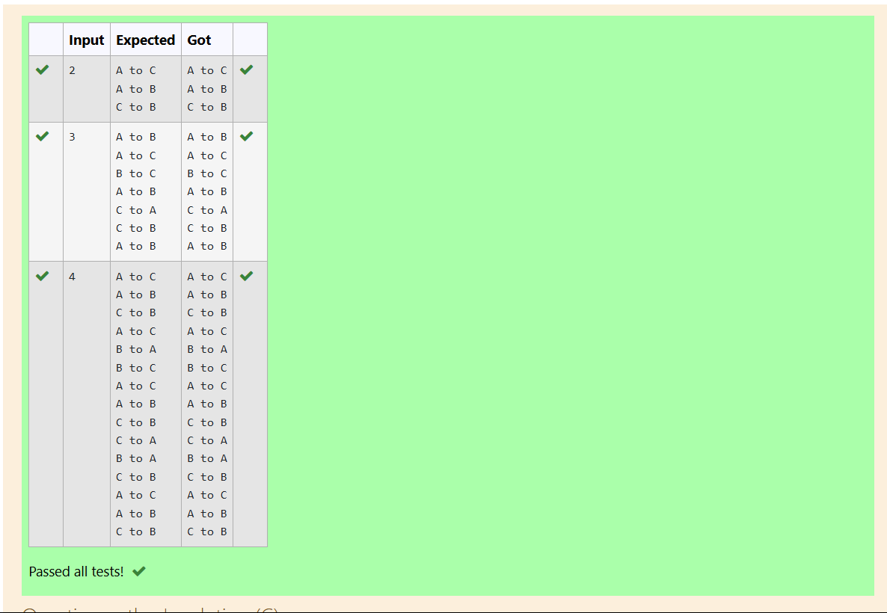

# EX3 Implementation of Tower of Hanoi
## DATE:
## AIM:
To write a C program to implement Tower of Hanoi

## Algorithm
1. If n > 0, proceed with the recursive process (i.e., at least one disk to move).
2. Call TOH(n-1, x, z, y) to move the top n-1 disks from source peg x to auxiliary peg z, using destination peg y as helper.
3. Print the move from source peg x to destination peg y.
4. Call TOH(n-1, z, y, x) to move the n-1 disks from auxiliary peg to destination peg y, using source peg x as helper.
5. The function continues recursively until all moves are printed, simulating the steps required to solve the Tower of Hanoi problem.

## Program:
```
/*
Program to implement Tower of Hanoi
Developed by: Kamalesh S
RegisterNumber: 212223040083

void TOH(int n,char x,char y,char z)
{
if(n>0)
   {
      TOH(n-1,x,z,y);
      printf("%c to %c",x,y);
      printf("\n");
      TOH(n-1,z,y,x);
   }
}
*/
```

## Output:



## Result:
Thus, the C program to implement Tower of Hanoi using recursion is implemented successfully.
