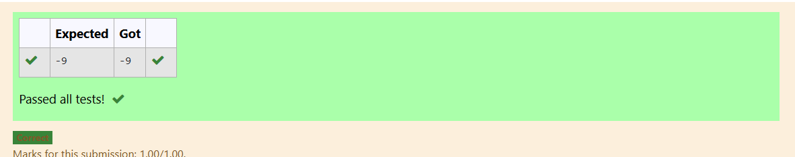

# Ex1(d) Evaluation of prefix expression
## DATE:26/04/25
## AIM:
To write a C function to evaluate the given prefix expression using stack and print the output of the given prefix expression from the stack inside the function . 

## Algorithm
1. Declare an integer stack with a top variable initialized to 0 .Define the prefix expression.
2. Loop through the expression from the last character to the first using a reverse for loop.
3. If the current character is a digit, convert it using prefix[i] - 48 and push it onto the stack.
4. If the character is an operator (+, -, *), pop the top two elements, apply the operator, and push the result back onto the stack.
5. After the loop ends, the final result of the prefix evaluation is the only remaining value in the stack. Print it. 

## Program:
```
/*
Program to evaluate the given prefix expression
Developed by: Kamalesh S
RegisterNumber: 212223040083
*/

#include<stdio.h>
#include<string.h>
#include<ctype.h>

int s[50];
int top=0;

void push(int ch)
{
	top++;
	s[top]=ch;
}

int pop()
{
	int ch;
	ch=s[top];
	top=top-1;
	return(ch);
}

void evalprefix(char prefix[50])
{
    int n3,i;
    for(i=strlen(prefix)-1;i>=0;i--)
    {
        if(prefix[i]=='+')
        {
            n3=pop()+pop();
            push(n3);
        }
        else if(prefix[i]=='-')
        {
            n3=pop()-pop();
            push(n3);
        }
        else if(prefix[i]=='*')
        {
            n3=pop()*pop();
            push(n3);
        }
        else
        {
            push(prefix[i]-48);
        }
    }
    printf("%d",pop());
}

int  main()
{
    char ch[50]="+-2*341";
    evalprefix(ch);
	return 0;
}

```

## Output:



## Result:
Thus, the C program to evaluate the prefix expression using stack and print the output of the given prefix expression from the stack inside the function is implemented successfully.
