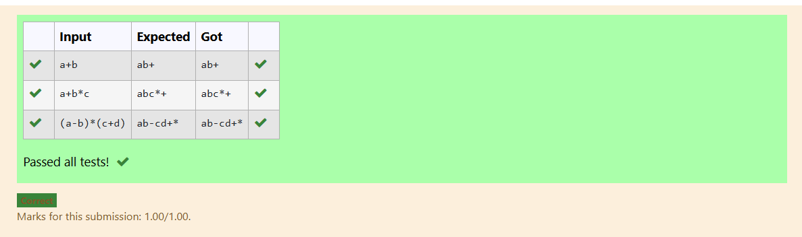

# Ex5 Stack Operations
## DATE:
## AIM:
To write a C function to perform push and pop operation of the stack in the infix to postfix conversion.

## Algorithm
1. Declare a character array stack[100] to hold stack elements.
Set the stack pointer top = -1 to indicate an empty stack.
2. To push a character x onto the stack:
Increment top by 1.
Assign the value x to stack[top].
Check for Stack Underflow in Pop
3. In the pop function, first check if top == -1 (i.e., the stack is empty).If so, return -1 to indicate an underflow condition.
4. If the stack is not empty, return stack[top] and decrement top by 1.
5. This stack can now be used for any LIFO-based operations like expression evaluation, string reversal, or syntax parsing.  

## Program:
```
/*
Program to find and display the priority of the operator in the given Postfix expression
Developed by: Kamalesh s
RegisterNumber:  212223040083

#include<stdio.h>

char stack[100];
int top = -1;

void push(char x)
{
   stack[++top] = x;

}

char pop()
{
   if(top == -1)
        return -1;
    else
        return stack[top--];

}

*/
```

## Output:



## Result:
Thus the C program to perform push and pop operation of the stack in the infix to postfix conversion is implemented successfully.
